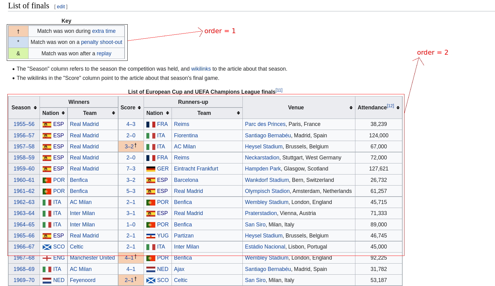
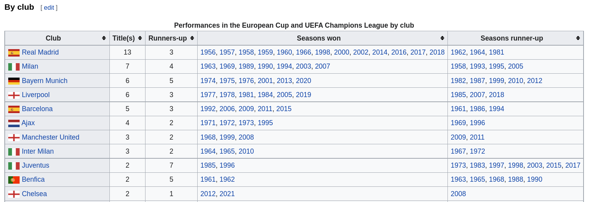
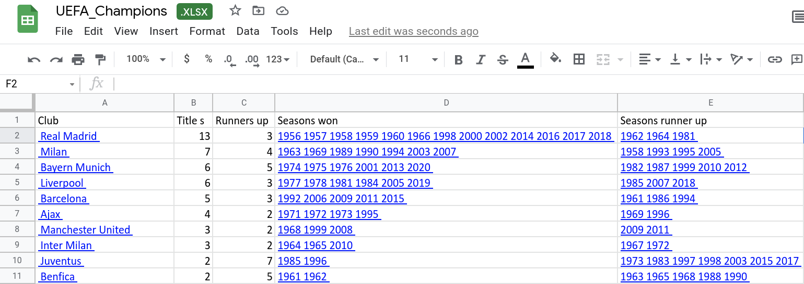

# WikiTable2Excel

This script to scrape wiki-tables to Excel Sheet with keeping all table hyper-links

## Code-Dependencies

All Dependencies in requirements.txt file to install all of them using pip just 

1. go to the directory where script and requirements.txt is located.
2. activate your virtualenv.
3. run in  `pip install -r requirements.txt` in your shell.

## Use Case

```python
scrape_wiki_table(url, save_to_dir , attribute, attr_value, order)
```

#### parameters

`url : Wiki-page URL`
`save_to_dir : Output path and name ex: "./Desktop/UEF_champions.xlsx"`
`attribute[optional]: get specific table types or scrape another website tables by HTML attributes`
`attr_value[optional] : previous attribute value ex (attribute = 'id', attr_value = '1234pn')`
`order[optional] : script by default scrape 1st table in the page you can scrape any table by its order on the page`

### Example

To Scrape [List_of_European_Cup_and_UEFA_Champions_League_finals](https://en.wikipedia.org/wiki/List_of_European_Cup_and_UEFA_Champions_League_finals)

Order of tables in the page.




###### Input

we will run our script to scrape table order = 3 in the page

```python
scrape_wiki_table(url = url,save_to_dir=output, order=3)
```




###### Output : is xlsx sheet with data and hyper links 



